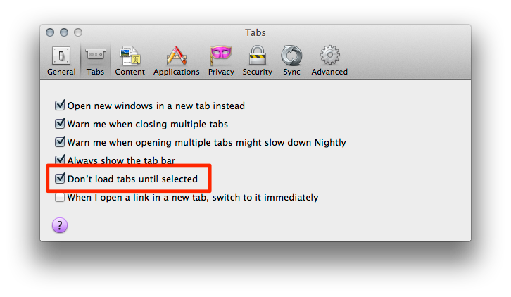

I know I just wrote about [some changes to Session Restore coming in Firefox 15](/posts/session-restore-changes-in-firefox-15), but here's another one...

Since Firefox 8, [we've had a visible preference to restore tabs "on demand"](/posts/max-concurrent-tabs-is-dead/). This surfaced as a checkbox on the "General" preference pane. The checkbox would only be accessible if you enabled Session Restore (by setting Firefox to "Show my windows and tabs from last time"). This was a bit unfortunate because the preference had effects even if you didn't have Session Restore enabled, namely, that preference was honored when restoring a session following a crash or when returning from Private Browsing mode. In order to change the preference, Session Restore had to be enabled temporarily.

We'll be changing that in Firefox 15 now that [bug 720154](https://bugzilla.mozilla.org/show_bug.cgi?id=720154) landed. The checkbox has been moved from the "General" pane to the "Tabs" pane and we've removed the dependency on Session Restore being enabled.

